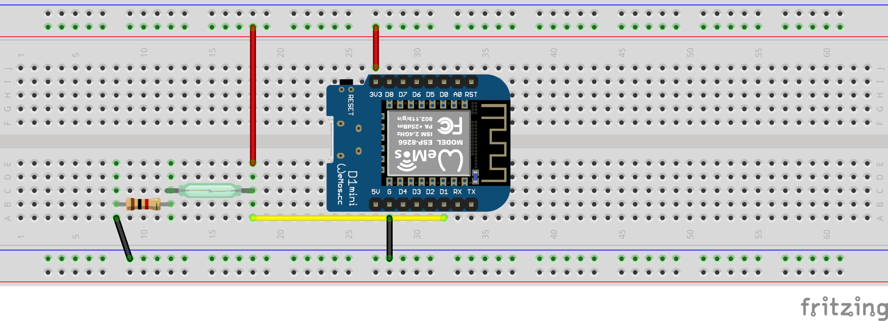

# Playground to learn ESP8266 and Reed Contact

[](https://opensource.org/licenses/MIT)

# What you need

1. ESP8266 module like D1 Mini
2. USB lead
3. Computer

# Getting started

1. download and install platformio IDE from https://platformio.org/platformio-ide
2. clone this repository. ```git clone https://github.com/bottomquark/esp8266_reed_contact.git```
3. plug in the ESP8266 module into the computer
4. start platform IDE and open this project
5. compile and upload. 

If you prefer working with a command line, see https://docs.platformio.org/en/latest/installation.html for installing.
After installation, cd to the location where you cloned the repository and type ```platformio run -t upload```

If the built in LED of the ESP8266 module flashes, everything worked.

Documentation:

* https://arduino-esp8266.readthedocs.io/en/latest/
* https://arduino-esp8266.readthedocs.io/en/latest/reference.html#digital-io

# breadboard layout
The resistor in the image is 1k but the value is not that important, you can use values between about 500 Ohms to a few k Ohms

The built in LED will light up for 200 ms when the reed contact is closed. If you have a contact which is normally closed (opens when a magnetic field is present), logic in the code has to be inverted.


# Program configuration
The program is configured using the `build_flag`. The table below lists all required and optional configuration possibilities:

| Build flag | Necessity | Default value | Description |
| - | - | - | - |
| LOG_LEVEL | no | LOG_LEVEL_VERBOSE | Sets the Log Level. Look [hier](https://github.com/georg-koch/Arduino-Log) for available Log Levels.| 
| DISABLE_LOGGING | no| | Set this flag (without any values) to disable the logging completely. |
| MQTT_HOST | yes | 127.0.0.1 | Set the IP address of [MQTT](http://mqtt.org) broker. |  
| MQTT_PORT | no  | 1883      | Set the Port to access MQTT broker. Port 1883 is the default port of [mosquitto](https://mosquitto.org) MQTT broker.|
| MQTT_CLIENT_ID | no | esp8266 | Client ID which is visible in MQTT broker as connected client. |
| MQTT_TOPIC_PUB | no | data/esp8266 | MQTT topic to which the measurements will be written. |
| MQTT_USER | no | | User to connect to MQTT broker. If not set, connection will be created with an anonymous user. |
| MQTT_PASS | no | | User password to connecto to MQTT broker. If not set, connection will be created with an anonymous user.|
| WIFI_SSID | yes | | SSID of your WiFi network. |
| WIFI_PASS | yes | | Password of your WiFi network. |
| WIFI_HOSTNAME | no | | Hostname with which the client appears on your network. If not set, the WiFi client will set a default depends on your platform. |

In the example you see in the `platformio.ini` file, I use the system environment variables for the network configuration. Those variables are set in my `~/.bash_profile` file like `export PLATFORMIO_WIFI_HOSTNAME=MyWiFi`. After editing of `~/.bash_profile` file, run command `source ~/.bash_profile` to inject the variables.

