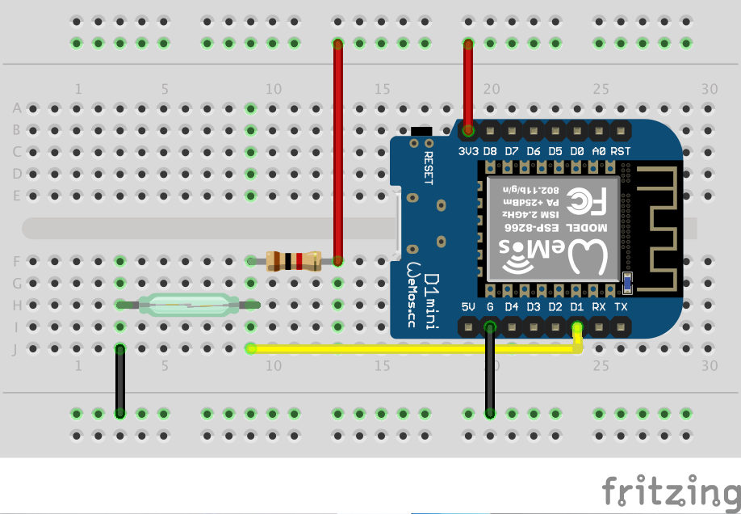

# What you need

1. ESP8266 module like D1 Mini
2. USB lead
3. Computer

# Getting started

1. download and install platformio IDE from https://platformio.org/platformio-ide
2. clone this repository. ```git clone https://github.com/bottomquark/esp8266_reed_contact.git```
3. plug in the ESP8266 module into the computer
4. start platform IDE and open this project
5. compile and upload. 

If you prefer working with a command line, see https://docs.platformio.org/en/latest/installation.html for installing.
After installation, cd to the location where you cloned the repository and type ```platformio run -t upload```

If the built in LED of the ESP8266 module flashes, everything worked.

Documentation:

https://arduino-esp8266.readthedocs.io/en/latest/
https://arduino-esp8266.readthedocs.io/en/latest/reference.html#digital-io

# breadboard layout
The resistor in the image is 1k but the value is not that important, you can use values between about 500 Ohms to a few k Ohms

The built in LED will light up for 200 ms when the reed contact is closed. If you have a contact which is normally closed (opens when a magnetic field is present), logic in the code has to be inverted.


# Program configuration

Find the default configuration in the file `config-default.h`. To do custom configuration:
* copy the default config file into `config.h`
* insert custom configuration
* compile
Note: The created `config.h` file registered to be ignored by git commit.
